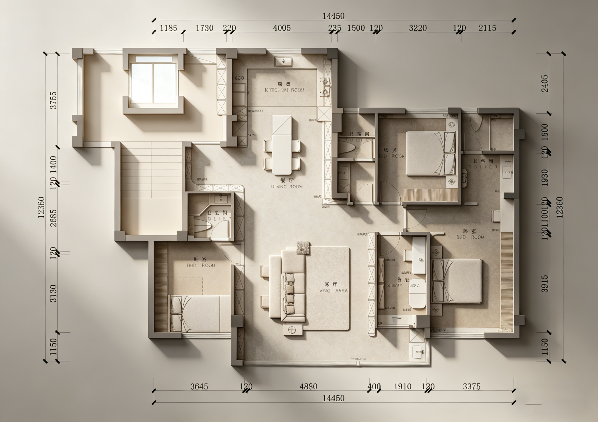

+++
title = "第一次沟通纪要：全屋设计方案深化与预算评审"
description = "与设计师的第一次正式方案沟通，敲定空间布局、收纳系统、设备选型及预算控制目标。"
date = 2026-04-10T10:00:00+08:00
weight = 1
+++

## 会议信息

| 项目 | 内容 |
|------|------|
| **会议主题** | 全屋设计方案深化与预算评审会 |
| **发言人/业主** | 胡毅宇 |
| **会议时长** | 约 2 小时 7 分钟 |

## 核心结论

否决三卫与全屋智能，敲定两卫+储藏间格局；全屋满墙定制柜；网络采用子母路由；现场签署设计合同。

## 设计图

---

## 横向时间线

  

    
00:00:10

    
弱电入户

    
机柜位置 超薄柜可行性

  

  

    
00:02:43

    
储物布局

    
满墙定制柜 儿童房布局

  

  

    
00:07:04

    
厨卫设备

    
岛台/电器柜 子母路由

  

  

    
00:12:25

    
书房客厅

    
缩书房扩客厅 室内窗隔断

  

  

    
00:17:13

    
智能窗帘

    
否决全屋智能 保留电动窗帘

  

  

    
00:20:38

    
方案比选

    
阳台家政间 一卫改储藏间

  

  

    
00:47:03

    
热水卫生间

    
回水泵 三卫改两卫

  

  

    
00:58:45

    
预算设备

    
约60投影面积 水电设备清单

  

  

    
01:13:39

    
合同效果

    
付款节点 效果图范围

  

  

    
01:41:53

    
签署落地

    
施工跟进周期 现场签约付款

  

  

    
01:59:44

    
网络弱电

    
子母路由确定 机柜散热预留

  

  

    
02:07:17

    
总结安排

    
整体方案满意 家人确认细节

  

---

## 关键决议

1. **空间**：三卫 → 两卫 + 储藏间（洞洞板/金属架收纳）
2. **智能**：仅保留电动窗帘 + 扫地机器人；子母路由覆盖全屋 Wi-Fi
3. **阳台**：纳入室内作家政间，烘干机解决晾晒
4. **收纳**：全屋满墙定制柜，杂物不外露
5. **热水**：远端加装回水泵
6. **合同**：按套内面积计费，现场签署；效果图重点做客厅、主卧、书房

---

## 待办事项

| 序号 | 事项 | 负责人 | 节点 |
|:----:|------|--------|------|
| 1 | 提供电器设备清单（含尺寸） | 业主 | 水电前 |
| 2 | 发送设备需求表格并回收 | 胡毅宇 | 会后 |
| 3 | 图纸脱敏（隐去敏感尺寸） | 胡毅宇 | 交付前 |
| 4 | 发送 PPT 及图纸 PDF | 胡毅宇 | 会后 |
| 5 | 对接定制方完成弱电机柜设计 | 设计师 & 定制方 | 施工图阶段 |
| 6 | 与家人确认卫生间细节 | 设计师 | 深化前 |
