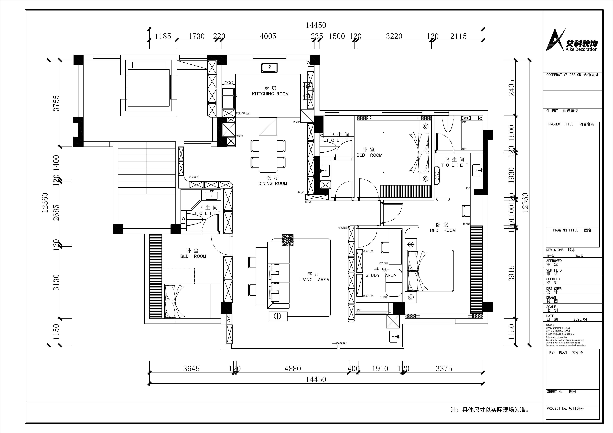

+++
title = "户型解读：平面布局方案"
description = "基于第二版平面布置图，逐区解读入户、客餐厅、书房、卧室及卫生间的空间关系与设计思路。"
date = 2026-04-10T10:00:00+08:00
+++

## 图纸概览

本套方案为 **第二版平面布置图**（2025.04），整体户型呈东西向展开，建筑面积约 140㎡ 左右。原始结构为 **四室两厅三卫**，经第一次沟通后，设计师将最左侧靠近儿童房的卫生间调整为 **储藏间**，最终格局为 **四室两厅两卫 + 储藏间**，在保留主要居住功能的前提下，通过联动门、定制柜体与空间借位，提升了客餐厅的通透感与全屋收纳效率。

> 注：具体尺寸以实际现场为准。图中标注的总开间约 12360 mm，总进深约 14450 mm。

---

## 整体格局

从入户方向（图纸右侧）进入，空间大致可分为 **五个功能区带**：

1. **入户玄关 + 餐厨区**（东侧）
2. **客餐厅一体区**（中部）
3. **主卧套房**（东北侧）
4. **次卧 + 书房联动区**（西侧）
5. **两卫 + 储藏间**（北、东各一卫，西侧原卫生间改为储藏间）

---

## 分区解读

### 1. 入户与玄关

- **造型玄关**：入户正面设置玄关柜，解决鞋履与外套收纳。
- **隐藏式联动门**：玄关与相邻空间之间采用联动门，平时敞开保证通透，需要时可封闭隔离。
- **电器柜**：入户侧墙预留电器柜，可嵌入弱电设备、路由器或家用服务器。

### 2. 厨房与餐厅

- **厨房（KITCHING ROOM）**：位于东北角，U 型或 L 型橱柜布局，洗切炒动线紧凑。与餐厅之间以移门或半开放隔断分隔，需确认燃气公司政策。
- **餐厅（DINING ROOM）**：位于中部偏东，六人餐桌尺度。一侧设置 **餐边柜 + 储藏柜**，另一侧与客厅连通，视觉上形成大横厅效果。

### 3. 客厅

- **客厅（LIVING AREA）**：位于户型正中央，是家中最大的开放空间。沙发背靠书房隔断，面向 **电视背景墙**。
- **展示柜**：电视背景一侧延伸出展示柜/收纳柜，与餐边柜形成连续的柜体界面。
- **采光**：客厅西侧（图纸下方）接阳台或大面积窗户，是全屋主要采光面。

### 4. 书房与卧室联动（西侧）

- **书房（STUDY AREA）**：位于西南角，布置 **成品书桌 + 沙发床 + 成品书架**。沙发床兼顾临时客房功能。
- **与客厅的关系**：书房与客厅之间以隔墙或室内窗分隔，设计师在第一次沟通中提出"缩小书房、扩大客厅视觉"的方向，此处可作为后续深化调整的重点。
- **相邻卧室**：书房北侧（图纸右侧）紧邻一间次卧，两室共用一面墙体，定制柜可一体化设计。

### 5. 卧室区

户型共有 **三间卧室**（不含书房临时床位）：

- **东北侧卧室**：靠近厨房与主卧卫生间，面积适中，适合作为儿童房或次卧。
- **南侧卧室**：位于东南角，相对独立，隐私性较好。
- **主卧**：图纸中主卧位置需结合现场梁柱判断，通常位于采光与视野最佳处。

### 6. 卫生间与储藏间分布

图中已按第一次沟通决议调整为 **两卫 + 储藏间**：

- **北侧卫生间**（中上部）：靠近东北侧卧室，保留淋浴区与壁龛。
- **东侧卫生间**（右中部）：靠近南侧卧室，保留干湿分区。
- **西侧储藏间**（左中部）：原最左侧靠近儿童房的卫生间已改为储藏间，内部可采用洞洞板或金属架系统，解决大件物品（儿童玩具、滑板车等）收纳难题。

> **与沟通纪要的对应**：第一次沟通中已明确"常住人口三人，保留三个卫生间略显浪费，决定将最左侧卫生间改造为储藏间"。此调整在第二版图纸中已落实，显著提升了全屋收纳能力。

---

## 关键尺寸速查

| 区域 | 参考尺寸（mm） | 说明 |
|------|---------------|------|
| 总开间 | 12360 | 东西向总宽度 |
| 总进深 | 14450 | 南北向总长度 |
| 客厅面宽 | 约 4880 | 客厅横向跨度，空间感充裕 |
| 主卧面宽 | 约 3645 | 主卧短边尺寸 |
| 书房面宽 | 约 3220 | 书房短边，后续可能适当压缩 |
| 厨房面宽 | 约 4005 | 厨房操作台面长度充足 |

---

## 设计亮点与待深化

**亮点**
- 客餐厅一体化 + 连续柜体界面，视觉上整洁统一。
- 书房沙发床兼顾多功能，适合偶尔留宿。
- 入户电器柜与弱电系统集中管理，便于后期维护。

**待深化**
- 储藏间内部收纳形式细化（洞洞板/金属架的分层方案）。
- 书房与客厅隔断形式：实体墙、室内窗还是口袋门？
- 阳台纳入室内后的家政间具体尺寸与烘干机位置。
- 全屋定制柜的精确投影面积（初估约 60㎡）。
